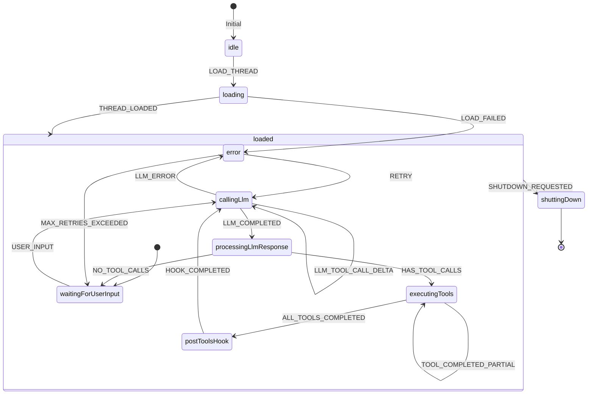
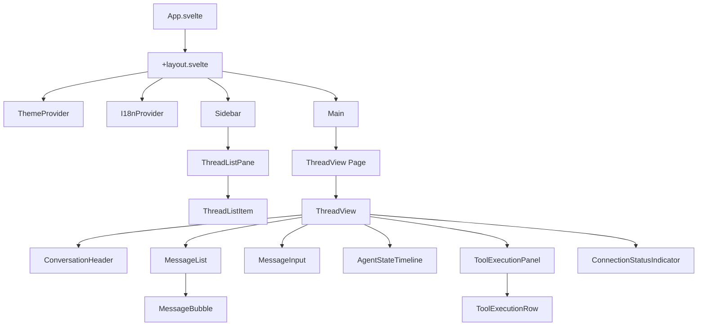
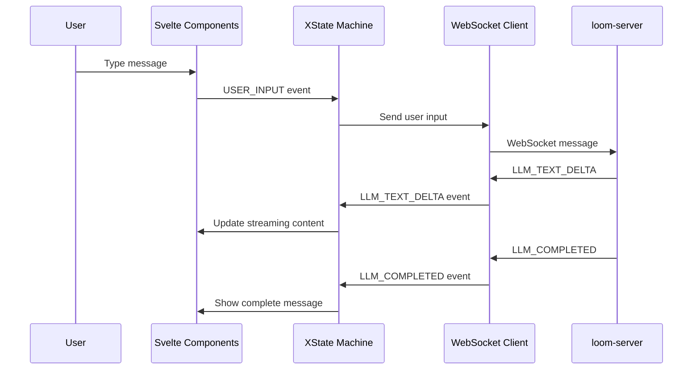

<!--
 Copyright (c) 2025 Geoffrey Huntley <ghuntley@ghuntley.com>. All rights reserved.
 SPDX-License-Identifier: Proprietary
-->

# Loom Web Application Specification

**Status:** Draft\
**Version:** 1.0\
**Last Updated:** 2024-12-23

---

## 1. Overview

### Purpose

Loom Web (`loom-web`) is a Svelte 5 web application that provides a browser-based interface for the
Loom AI coding agent system. It enables users to view, manage, and interact with conversation
threads, visualize agent state transitions, and monitor tool executions in real-time.

### Goals

- **Thread Management**: View, search, and manage conversation threads
- **Real-time Streaming**: Display LLM responses as they stream via WebSocket/SSE
- **State Visualization**: Mirror backend agent state machine in the UI
- **Tool Monitoring**: Show tool execution status and progress
- **Accessibility**: Support light/dark mode and i18n (English, Spanish)
- **Testability**: Property-based tests with documented invariants

### Non-Goals (v1)

- Real-time multi-user collaboration on threads
- End-to-end encryption
- Offline support with local caching
- Full agent hosting in browser (agent runs server-side)

---

## 2. Project Structure

```
loom/
├── crates/                    # Existing Rust crates
└── web/
    └── loom-web/
        ├── package.json
        ├── svelte.config.js
        ├── vite.config.ts
        ├── tailwind.config.cjs
        ├── postcss.config.cjs
        ├── tsconfig.json
        ├── vitest.config.ts
        ├── .linguirc
        ├── .storybook/
        │   ├── main.ts
        │   └── preview.ts
        └── src/
            ├── app.html
            ├── app.css              # Global styles with CSS variables
            ├── routes/
            │   ├── +layout.svelte
            │   ├── +page.svelte     # Redirects to /threads
            │   └── threads/
            │       ├── +page.svelte
            │       └── [threadId]/
            │           └── +page.svelte
            ├── lib/
            │   ├── ui/              # Tailwind component library
            │   │   ├── Button.svelte
            │   │   ├── Card.svelte
            │   │   ├── Badge.svelte
            │   │   ├── Input.svelte
            │   │   ├── Select.svelte
            │   │   ├── Tabs.svelte
            │   │   ├── Skeleton.svelte
            │   │   ├── AgentStateBadge.svelte
            │   │   ├── ToolStatusBadge.svelte
            │   │   ├── ThemeProvider.svelte
            │   │   ├── theme.ts
            │   │   └── index.ts
            │   ├── state/           # XState machines
            │   │   ├── conversationMachine.ts
            │   │   ├── connectionMachine.ts
            │   │   ├── threadListMachine.ts
            │   │   └── index.ts
            │   ├── api/             # Typed API client
            │   │   ├── client.ts
            │   │   ├── types.ts
            │   │   └── index.ts
            │   ├── realtime/        # WebSocket/SSE client
            │   │   ├── wsClient.ts
            │   │   ├── sseClient.ts
            │   │   ├── types.ts
            │   │   └── index.ts
            │   ├── logging/         # Structured logging
            │   │   ├── logger.ts
            │   │   └── index.ts
            │   ├── i18n/            # LinguiJS setup
            │   │   ├── i18n.ts
            │   │   ├── I18nProvider.svelte
            │   │   └── index.ts
            │   └── components/      # Feature components
            │       ├── ThreadListPane.svelte
            │       ├── ThreadListItem.svelte
            │       ├── ThreadView.svelte
            │       ├── ConversationHeader.svelte
            │       ├── MessageList.svelte
            │       ├── MessageBubble.svelte
            │       ├── MessageInput.svelte
            │       ├── AgentStateTimeline.svelte
            │       ├── ToolExecutionPanel.svelte
            │       ├── ToolExecutionRow.svelte
            │       ├── ConnectionStatusIndicator.svelte
            │       └── index.ts
            ├── locales/
            │   ├── en/
            │   │   └── messages.po
            │   └── es/
            │       └── messages.po
            └── test/
                ├── setup.ts
                ├── state/
                │   ├── conversationMachine.test.ts
                │   └── connectionMachine.test.ts
                └── lib/
                    └── api.test.ts
```

---

## 3. Design System & Tailwind Component Library

### 3.1 Design Tokens

CSS variables define the design system, enabling light/dark mode switching:

```css
:root {
  /* Background */
  --color-bg: #ffffff;
  --color-bg-muted: #f8fafc;
  --color-bg-subtle: #f1f5f9;
  
  /* Foreground */
  --color-fg: #0f172a;
  --color-fg-muted: #475569;
  --color-fg-subtle: #94a3b8;
  
  /* Accent */
  --color-accent: #4f46e5;
  --color-accent-soft: #eef2ff;
  --color-accent-hover: #4338ca;
  
  /* Border */
  --color-border: #e2e8f0;
  --color-border-muted: #f1f5f9;
  
  /* Status */
  --color-error: #dc2626;
  --color-error-soft: #fef2f2;
  --color-success: #16a34a;
  --color-success-soft: #f0fdf4;
  --color-warning: #f97316;
  --color-warning-soft: #fff7ed;
  
  /* Radii */
  --radius-sm: 0.25rem;
  --radius-md: 0.375rem;
  --radius-lg: 0.5rem;
  --radius-full: 9999px;
}

.dark {
  --color-bg: #0f172a;
  --color-bg-muted: #1e293b;
  --color-bg-subtle: #334155;
  --color-fg: #f1f5f9;
  --color-fg-muted: #94a3b8;
  --color-fg-subtle: #64748b;
  --color-accent: #818cf8;
  --color-accent-soft: #1e1b4b;
  --color-accent-hover: #6366f1;
  --color-border: #334155;
  --color-border-muted: #1e293b;
  --color-error: #f87171;
  --color-error-soft: #450a0a;
  --color-success: #4ade80;
  --color-success-soft: #052e16;
  --color-warning: #fb923c;
  --color-warning-soft: #431407;
}
```

### 3.2 Tailwind Configuration

```javascript
// tailwind.config.cjs
module.exports = {
	darkMode: 'class',
	content: ['./src/**/*.{svelte,ts,js}'],
	theme: {
		extend: {
			colors: {
				bg: 'var(--color-bg)',
				'bg-muted': 'var(--color-bg-muted)',
				'bg-subtle': 'var(--color-bg-subtle)',
				fg: 'var(--color-fg)',
				'fg-muted': 'var(--color-fg-muted)',
				'fg-subtle': 'var(--color-fg-subtle)',
				accent: 'var(--color-accent)',
				'accent-soft': 'var(--color-accent-soft)',
				'accent-hover': 'var(--color-accent-hover)',
				border: 'var(--color-border)',
				'border-muted': 'var(--color-border-muted)',
				error: 'var(--color-error)',
				'error-soft': 'var(--color-error-soft)',
				success: 'var(--color-success)',
				'success-soft': 'var(--color-success-soft)',
				warning: 'var(--color-warning)',
				'warning-soft': 'var(--color-warning-soft)',
			},
			borderRadius: {
				sm: 'var(--radius-sm)',
				md: 'var(--radius-md)',
				lg: 'var(--radius-lg)',
				full: 'var(--radius-full)',
			},
		},
	},
};
```

### 3.3 Base UI Components

| Component  | Purpose                                    |
| ---------- | ------------------------------------------ |
| `Button`   | Primary, secondary, ghost, danger variants |
| `Card`     | Container with header, body, footer slots  |
| `Badge`    | Small status indicators                    |
| `Input`    | Text input with label, error states        |
| `Select`   | Dropdown selection                         |
| `Tabs`     | Tab navigation                             |
| `Skeleton` | Loading placeholder                        |

### 3.4 Agent-Specific Components

| Component         | Purpose                                |
| ----------------- | -------------------------------------- |
| `AgentStateBadge` | Maps `AgentStateKind` to colored badge |
| `ToolStatusBadge` | Maps `ToolExecutionStatus` to badge    |
| `ThemeProvider`   | Manages dark/light mode                |

#### AgentStateBadge Mapping

| State                     | Color  | Icon |
| ------------------------- | ------ | ---- |
| `waiting_for_user_input`  | Gray   | ⏳   |
| `calling_llm`             | Blue   | 🔄   |
| `processing_llm_response` | Blue   | 📝   |
| `executing_tools`         | Yellow | ⚙️    |
| `post_tools_hook`         | Yellow | 🔧   |
| `error`                   | Red    | ❌   |
| `shutting_down`           | Gray   | 🛑   |

---

## 4. State Machine Design (XState)

### 4.1 Conversation Machine

The conversation machine mirrors the backend `AgentState` enum, ensuring UI state transitions align
with server state.



#### TypeScript Definition

```typescript
// src/lib/state/conversationMachine.ts
import { createMachine, assign } from 'xstate';
import type { Thread, AgentStateKind, ToolExecutionStatus, MessageSnapshot } from '../api/types';

interface ConversationContext {
	thread: Thread | null;
	messages: MessageSnapshot[];
	currentAgentState: AgentStateKind;
	toolExecutions: ToolExecutionStatus[];
	streamingContent: string;
	error: string | null;
	retries: number;
}

type ConversationEvent =
	| { type: 'LOAD_THREAD'; threadId: string }
	| { type: 'THREAD_LOADED'; thread: Thread }
	| { type: 'LOAD_FAILED'; error: string }
	| { type: 'USER_INPUT'; content: string }
	| { type: 'LLM_TEXT_DELTA'; content: string }
	| { type: 'LLM_TOOL_CALL_DELTA'; callId: string; toolName: string; argsFragment: string }
	| { type: 'LLM_COMPLETED'; response: LlmResponse }
	| { type: 'LLM_ERROR'; error: string }
	| { type: 'TOOL_PROGRESS'; callId: string; progress: ToolProgress }
	| { type: 'TOOL_COMPLETED'; callId: string; outcome: ToolExecutionOutcome }
	| { type: 'RETRY' }
	| { type: 'SHUTDOWN_REQUESTED' };

export const conversationMachine = createMachine({
	id: 'conversation',
	initial: 'idle',
	context: {
		thread: null,
		messages: [],
		currentAgentState: 'waiting_for_user_input',
		toolExecutions: [],
		streamingContent: '',
		error: null,
		retries: 0,
	} satisfies ConversationContext,
	states: {
		idle: {
			on: { LOAD_THREAD: 'loading' },
		},
		loading: {
			on: {
				THREAD_LOADED: { target: 'loaded', actions: 'setThread' },
				LOAD_FAILED: { target: 'error', actions: 'setError' },
			},
		},
		loaded: {
			initial: 'waitingForUserInput',
			states: {
				waitingForUserInput: {
					entry: assign({ currentAgentState: 'waiting_for_user_input' }),
					on: { USER_INPUT: 'callingLlm' },
				},
				callingLlm: {
					entry: assign({ currentAgentState: 'calling_llm', streamingContent: '' }),
					on: {
						LLM_TEXT_DELTA: { actions: 'appendStreamingContent' },
						LLM_TOOL_CALL_DELTA: { actions: 'updateToolCallDelta' },
						LLM_COMPLETED: 'processingLlmResponse',
						LLM_ERROR: 'error',
					},
				},
				processingLlmResponse: {
					entry: assign({ currentAgentState: 'processing_llm_response' }),
					always: [
						{ guard: 'hasToolCalls', target: 'executingTools' },
						{ target: 'waitingForUserInput' },
					],
				},
				executingTools: {
					entry: assign({ currentAgentState: 'executing_tools' }),
					on: {
						TOOL_PROGRESS: { actions: 'updateToolProgress' },
						TOOL_COMPLETED: [
							{ guard: 'allToolsCompleted', target: 'postToolsHook' },
							{ actions: 'markToolCompleted' },
						],
					},
				},
				postToolsHook: {
					entry: assign({ currentAgentState: 'post_tools_hook' }),
					after: { 100: 'callingLlm' }, // Auto-transition after hook
				},
				error: {
					entry: assign({ currentAgentState: 'error' }),
					on: {
						RETRY: { guard: 'canRetry', target: 'callingLlm', actions: 'incrementRetry' },
					},
				},
			},
			on: { SHUTDOWN_REQUESTED: 'shuttingDown' },
		},
		shuttingDown: {
			entry: assign({ currentAgentState: 'shutting_down' }),
			type: 'final',
		},
		error: {
			on: { LOAD_THREAD: 'loading' },
		},
	},
});
```

### 4.2 Connection Machine

```typescript
// src/lib/state/connectionMachine.ts
import { createMachine, assign } from 'xstate';

interface ConnectionContext {
	sessionId: string | null;
	retries: number;
	maxRetries: number;
	lastError: string | null;
}

type ConnectionEvent =
	| { type: 'CONNECT'; sessionId: string }
	| { type: 'CONNECTED' }
	| { type: 'DISCONNECTED'; error?: string }
	| { type: 'RETRY' }
	| { type: 'GIVE_UP' };

export const connectionMachine = createMachine({
	id: 'connection',
	initial: 'disconnected',
	context: {
		sessionId: null,
		retries: 0,
		maxRetries: 5,
		lastError: null,
	} satisfies ConnectionContext,
	states: {
		disconnected: {
			on: { CONNECT: { target: 'connecting', actions: 'setSessionId' } },
		},
		connecting: {
			on: {
				CONNECTED: 'connected',
				DISCONNECTED: 'reconnecting',
			},
		},
		connected: {
			on: { DISCONNECTED: 'reconnecting' },
		},
		reconnecting: {
			entry: assign({ retries: (ctx) => ctx.retries + 1 }),
			on: {
				CONNECTED: { target: 'connected', actions: 'resetRetries' },
				RETRY: { guard: 'canRetry', target: 'connecting' },
				GIVE_UP: 'failed',
			},
		},
		failed: {
			on: { CONNECT: { target: 'connecting', actions: 'resetRetries' } },
		},
	},
});
```

### 4.3 Thread List Machine

```typescript
// src/lib/state/threadListMachine.ts
import { createMachine, assign } from 'xstate';
import type { ThreadSummary } from '../api/types';

interface ThreadListContext {
	threads: ThreadSummary[];
	searchQuery: string;
	limit: number;
	offset: number;
	total: number;
	error: string | null;
}

export const threadListMachine = createMachine({
	id: 'threadList',
	initial: 'idle',
	context: {
		threads: [],
		searchQuery: '',
		limit: 50,
		offset: 0,
		total: 0,
		error: null,
	} satisfies ThreadListContext,
	states: {
		idle: {
			on: { FETCH: 'loading' },
		},
		loading: {
			on: {
				FETCH_SUCCESS: { target: 'loaded', actions: 'setThreads' },
				FETCH_ERROR: { target: 'error', actions: 'setError' },
			},
		},
		loaded: {
			on: {
				FETCH: 'loading',
				SEARCH: { target: 'loading', actions: 'setSearchQuery' },
				NEXT_PAGE: { target: 'loading', actions: 'incrementOffset' },
				PREV_PAGE: { target: 'loading', actions: 'decrementOffset' },
			},
		},
		error: {
			on: { FETCH: 'loading' },
		},
	},
});
```

---

## 5. Svelte 5 Component Hierarchy

### 5.1 Routes

| Route                | Component        | Description             |
| -------------------- | ---------------- | ----------------------- |
| `/`                  | Redirect         | Redirects to `/threads` |
| `/threads`           | `ThreadListPage` | Thread list with search |
| `/threads/:threadId` | `ThreadViewPage` | Full conversation view  |

### 5.2 Layout Structure

```
+layout.svelte
├── ThemeProvider
├── I18nProvider
└── LoggerContext
    ├── Sidebar
    │   └── ThreadListPane
    └── Main
        └── [route content]
```

### 5.3 Component Specifications

#### ThreadListPane

```svelte
<!-- Props -->
export let selectedThreadId: string | null = null;

<!-- State -->
Uses threadListMachine for fetch state

<!-- Features -->
- Search input with debounce
- Virtualized list for performance
- Click to select thread
- Visual indication of current thread
```

#### ThreadView

```svelte
<!-- Props -->
export let threadId: string;

<!-- State -->
Uses conversationMachine for thread state
Uses connectionMachine for WebSocket state

<!-- Features -->
- Fetches thread on mount
- Connects to realtime stream
- Syncs machine state with incoming events
- Displays conversation, agent state, tool status
```

#### MessageBubble

```svelte
<!-- Props -->
export let message: MessageSnapshot;
export let isStreaming: boolean = false;

<!-- Variants by role -->
- user: Right-aligned, accent background
- assistant: Left-aligned, muted background
- tool: Collapsible, shows input/output
- system: Centered, subtle styling
```

#### AgentStateTimeline

```svelte
<!-- Props -->
export let currentState: AgentStateKind;
export let retries: number = 0;
export let pendingToolCalls: string[] = [];

<!-- Features -->
- Horizontal state sequence
- Current state highlighted
- Shows retry count in error state
- Shows tool count in executing_tools
```

#### ToolExecutionPanel

```svelte
<!-- Props -->
export let executions: ToolExecutionStatus[];

<!-- Features -->
- Collapsible panel
- Shows each tool with status badge
- Timestamps for lifecycle events
- Expandable output preview
```

---

## 6. Real-time Communication

### 6.1 WebSocket Client (Phase 3)

```typescript
// src/lib/realtime/wsClient.ts
import type { RealtimeMessage, LlmEventWire } from './types';

export class LoomWebSocketClient {
	private ws: WebSocket | null = null;
	private messageHandlers: Set<(msg: RealtimeMessage) => void> = new Set();
	private statusHandlers: Set<(status: ConnectionStatus) => void> = new Set();

	constructor(private serverUrl: string) {}

	async connect(sessionId: string): Promise<void> {
		const wsUrl = this.serverUrl.replace(/^http/, 'ws');
		this.ws = new WebSocket(`${wsUrl}/v1/ws/sessions/${sessionId}`);

		this.ws.onopen = () => this.notifyStatus('connected');
		this.ws.onclose = () => this.notifyStatus('disconnected');
		this.ws.onerror = () => this.notifyStatus('error');
		this.ws.onmessage = (event) => this.handleMessage(event);
	}

	disconnect(): void {
		this.ws?.close();
		this.ws = null;
	}

	send(msg: RealtimeMessage): void {
		this.ws?.send(JSON.stringify(msg));
	}

	onMessage(handler: (msg: RealtimeMessage) => void): () => void {
		this.messageHandlers.add(handler);
		return () => this.messageHandlers.delete(handler);
	}

	onStatus(handler: (status: ConnectionStatus) => void): () => void {
		this.statusHandlers.add(handler);
		return () => this.statusHandlers.delete(handler);
	}

	private handleMessage(event: MessageEvent): void {
		const msg = JSON.parse(event.data) as RealtimeMessage;
		this.messageHandlers.forEach((h) => h(msg));
	}

	private notifyStatus(status: ConnectionStatus): void {
		this.statusHandlers.forEach((h) => h(status));
	}
}
```

### 6.2 SSE Fallback

```typescript
// src/lib/realtime/sseClient.ts
export class LoomSseClient {
	private eventSource: EventSource | null = null;

	constructor(private serverUrl: string) {}

	connect(provider: 'anthropic' | 'openai'): void {
		const url = `${this.serverUrl}/proxy/${provider}/stream`;
		this.eventSource = new EventSource(url);

		this.eventSource.addEventListener('llm', (event) => {
			const data = JSON.parse(event.data);
			// Convert to LlmEvent and dispatch
		});
	}

	disconnect(): void {
		this.eventSource?.close();
	}
}
```

### 6.3 Message Types

```typescript
// src/lib/realtime/types.ts
export type ConnectionStatus = 'disconnected' | 'connecting' | 'connected' | 'error';

export type RealtimeMessage =
	| { type: 'llm_event'; id: string; data: LlmEventWire; timestamp: string }
	| { type: 'server_query'; id: string; data: ServerQueryWire; timestamp: string }
	| { type: 'query_response'; id: string; data: QueryResponseWire; timestamp: string }
	| { type: 'control'; id: string; data: ControlWire; timestamp: string }
	| { type: 'ack'; id: string; data: AckWire; timestamp: string };

export interface LlmEventWire {
	event_type: 'text_delta' | 'tool_call_delta' | 'completed' | 'error';
	content?: string;
	call_id?: string;
	tool_name?: string;
	arguments_fragment?: string;
	response?: LlmResponse;
	error?: string;
}
```

---

## 7. API Integration

### 7.1 Existing Endpoints

| Endpoint                      | Method | Purpose                      |
| ----------------------------- | ------ | ---------------------------- |
| `/v1/threads`                 | GET    | List threads with pagination |
| `/v1/threads/search`          | GET    | Full-text search             |
| `/v1/threads/{id}`            | GET    | Fetch single thread          |
| `/v1/threads/{id}`            | PUT    | Create/update thread         |
| `/v1/threads/{id}`            | DELETE | Delete thread                |
| `/v1/threads/{id}/visibility` | POST   | Update visibility            |
| `/proxy/anthropic/complete`   | POST   | Non-streaming completion     |
| `/proxy/anthropic/stream`     | POST   | SSE streaming                |
| `/proxy/openai/complete`      | POST   | Non-streaming completion     |
| `/proxy/openai/stream`        | POST   | SSE streaming                |
| `/health`                     | GET    | Health check                 |
| `/metrics`                    | GET    | Prometheus metrics           |

### 7.2 New Endpoints Required

| Endpoint                       | Method        | Purpose                              |
| ------------------------------ | ------------- | ------------------------------------ |
| `/v1/ws/sessions/{session_id}` | GET (Upgrade) | WebSocket connection                 |
| `/v1/threads/{id}/session`     | POST          | Create session for thread (optional) |

### 7.3 API Client

```typescript
// src/lib/api/client.ts
import type { Thread, ThreadSummary, ListResponse, SearchResponse } from './types';

export class LoomApiClient {
	constructor(private baseUrl: string = '') {}

	async listThreads(params: ListParams = {}): Promise<ListResponse> {
		const query = new URLSearchParams();
		if (params.workspace) query.set('workspace', params.workspace);
		if (params.limit) query.set('limit', String(params.limit));
		if (params.offset) query.set('offset', String(params.offset));

		const res = await fetch(`${this.baseUrl}/v1/threads?${query}`);
		if (!res.ok) throw new ApiError(res.status, await res.text());
		return res.json();
	}

	async getThread(id: string): Promise<Thread> {
		const res = await fetch(`${this.baseUrl}/v1/threads/${id}`);
		if (!res.ok) throw new ApiError(res.status, await res.text());
		return res.json();
	}

	async searchThreads(query: string, params: SearchParams = {}): Promise<SearchResponse> {
		const searchParams = new URLSearchParams({ q: query });
		if (params.limit) searchParams.set('limit', String(params.limit));
		if (params.offset) searchParams.set('offset', String(params.offset));

		const res = await fetch(`${this.baseUrl}/v1/threads/search?${searchParams}`);
		if (!res.ok) throw new ApiError(res.status, await res.text());
		return res.json();
	}

	async deleteThread(id: string): Promise<void> {
		const res = await fetch(`${this.baseUrl}/v1/threads/${id}`, { method: 'DELETE' });
		if (!res.ok) throw new ApiError(res.status, await res.text());
	}

	async updateVisibility(id: string, visibility: ThreadVisibility): Promise<Thread> {
		const res = await fetch(`${this.baseUrl}/v1/threads/${id}/visibility`, {
			method: 'POST',
			headers: { 'Content-Type': 'application/json' },
			body: JSON.stringify({ visibility }),
		});
		if (!res.ok) throw new ApiError(res.status, await res.text());
		return res.json();
	}
}
```

### 7.4 TypeScript Types (mirroring Rust)

```typescript
// src/lib/api/types.ts
export interface ThreadId {
	value: string; // T-{uuid7}
}

export type ThreadVisibility = 'organization' | 'private' | 'public';

export type AgentStateKind =
	| 'waiting_for_user_input'
	| 'calling_llm'
	| 'processing_llm_response'
	| 'executing_tools'
	| 'post_tools_hook'
	| 'error'
	| 'shutting_down';

export interface Thread {
	id: string;
	version: number;
	created_at: string;
	updated_at: string;
	last_activity_at: string;
	workspace_root: string | null;
	cwd: string | null;
	loom_version: string | null;
	provider: string | null;
	model: string | null;
	visibility: ThreadVisibility;
	is_private: boolean;
	is_shared_with_support: boolean;
	conversation: ConversationSnapshot;
	agent_state: AgentStateSnapshot;
	metadata: ThreadMetadata;
}

export interface ConversationSnapshot {
	messages: MessageSnapshot[];
}

export interface MessageSnapshot {
	id: string | null;
	role: 'user' | 'assistant' | 'tool' | 'system';
	content: string;
	tool_name: string | null;
	tool_call_id: string | null;
	tool_input: unknown | null;
	tool_output: unknown | null;
	created_at: string | null;
}

export interface AgentStateSnapshot {
	kind: AgentStateKind;
	retries: number;
	last_error: string | null;
	pending_tool_calls: string[];
}

export interface ThreadMetadata {
	title: string | null;
	tags: string[];
	is_pinned: boolean;
	extra: Record<string, unknown>;
}

export interface ThreadSummary {
	id: string;
	title: string | null;
	workspace_root: string | null;
	last_activity_at: string;
	provider: string | null;
	model: string | null;
	tags: string[];
	version: number;
	message_count: number;
}

export interface ListResponse {
	threads: ThreadSummary[];
	total: number;
	limit: number;
	offset: number;
}

export interface SearchResponse {
	hits: SearchHit[];
	limit: number;
	offset: number;
}

export interface SearchHit extends ThreadSummary {
	score: number;
}

export type ToolExecutionStatus =
	| { type: 'pending'; call_id: string; tool_name: string; requested_at: string }
	| {
			type: 'running';
			call_id: string;
			tool_name: string;
			started_at: string;
			progress?: ToolProgress;
	  }
	| { type: 'completed'; call_id: string; tool_name: string; outcome: ToolExecutionOutcome };

export interface ToolProgress {
	fraction: number | null;
	message: string | null;
	units_processed: number | null;
}

export type ToolExecutionOutcome =
	| { type: 'success'; output: unknown }
	| { type: 'error'; error: string };
```

---

## 8. Internationalization (LinguiJS)

### 8.1 Configuration

```json
// .linguirc
{
	"locales": ["en", "es"],
	"sourceLocale": "en",
	"catalogs": [
		{
			"path": "src/locales/{locale}/messages",
			"include": ["src"]
		}
	],
	"format": "po"
}
```

### 8.2 Setup

```typescript
// src/lib/i18n/i18n.ts
import { i18n } from '@lingui/core';
import { en, es } from 'make-plural/plurals';

i18n.loadLocaleData('en', { plurals: en });
i18n.loadLocaleData('es', { plurals: es });

export type Locale = 'en' | 'es';

export async function activateLocale(locale: Locale): Promise<void> {
	const { messages } = await import(`../../locales/${locale}/messages.po`);
	i18n.load(locale, messages);
	i18n.activate(locale);
}

export function getPreferredLocale(): Locale {
	const stored = localStorage.getItem('loom-locale');
	if (stored === 'en' || stored === 'es') return stored;

	const browser = navigator.language.split('-')[0];
	return browser === 'es' ? 'es' : 'en';
}
```

### 8.3 Translations Required

| Key                       | English           | Spanish                 |
| ------------------------- | ----------------- | ----------------------- |
| `nav.threads`             | Threads           | Hilos                   |
| `nav.settings`            | Settings          | Configuración           |
| `thread.new`              | New Thread        | Nuevo Hilo              |
| `thread.delete`           | Delete            | Eliminar                |
| `thread.search`           | Search threads... | Buscar hilos...         |
| `state.waiting`           | Waiting for input | Esperando entrada       |
| `state.calling_llm`       | Calling LLM       | Llamando LLM            |
| `state.executing_tools`   | Executing tools   | Ejecutando herramientas |
| `state.error`             | Error             | Error                   |
| `tool.pending`            | Pending           | Pendiente               |
| `tool.running`            | Running           | Ejecutando              |
| `tool.completed`          | Completed         | Completado              |
| `connection.connected`    | Connected         | Conectado               |
| `connection.disconnected` | Disconnected      | Desconectado            |
| `connection.reconnecting` | Reconnecting...   | Reconectando...         |

---

## 9. Testing Strategy

### 9.1 Property-Based Tests with fast-check

All property tests must document:

1. **Why this is important** - The real-world failure this prevents
2. **Invariant** - The formal property being verified

#### State Machine Properties

```typescript
// src/test/state/conversationMachine.test.ts
import { describe, it, expect } from 'vitest';
import { test } from '@fast-check/vitest';
import * as fc from 'fast-check';
import { createActor } from 'xstate';
import { conversationMachine } from '../../lib/state/conversationMachine';

const agentStateKinds = [
	'waiting_for_user_input',
	'calling_llm',
	'processing_llm_response',
	'executing_tools',
	'post_tools_hook',
	'error',
	'shutting_down',
] as const;

const eventArb = fc.constantFrom(
	{ type: 'USER_INPUT', content: 'test' },
	{ type: 'LLM_TEXT_DELTA', content: 'hello' },
	{ type: 'LLM_COMPLETED', response: {} },
	{ type: 'LLM_ERROR', error: 'timeout' },
	{ type: 'TOOL_COMPLETED', callId: '1', outcome: { type: 'success', output: {} } },
	{ type: 'RETRY' },
	{ type: 'SHUTDOWN_REQUESTED' }
);

describe('conversationMachine', () => {
	/**
	 * **Property: Agent state is always a valid AgentStateKind**
	 *
	 * **Why this is important**: If the UI displays an invalid agent state,
	 * users see broken/missing state badges and cannot understand what the
	 * agent is doing. This property ensures all reachable states map to
	 * valid backend AgentStateKind values.
	 *
	 * **Invariant**: ∀ event sequences E, context.currentAgentState ∈ AgentStateKind
	 */
	test.prop([fc.array(eventArb, { maxLength: 50 })])('agent_state_always_valid', (events) => {
		const actor = createActor(conversationMachine);
		actor.start();
		actor.send({ type: 'LOAD_THREAD', threadId: 'T-test' });
		actor.send({ type: 'THREAD_LOADED', thread: mockThread() });

		for (const event of events) {
			actor.send(event);
		}

		const state = actor.getSnapshot().context.currentAgentState;
		expect(agentStateKinds).toContain(state);
	});

	/**
	 * **Property: SHUTDOWN_REQUESTED always transitions to shuttingDown**
	 *
	 * **Why this is important**: Users must be able to gracefully exit at any
	 * point. If shutdown can be blocked, users get stuck in unresponsive UI.
	 *
	 * **Invariant**: ∀ reachable states s, send(SHUTDOWN_REQUESTED) → shuttingDown
	 */
	test.prop([fc.array(eventArb, { maxLength: 20 })])('shutdown_always_succeeds', (events) => {
		const actor = createActor(conversationMachine);
		actor.start();
		actor.send({ type: 'LOAD_THREAD', threadId: 'T-test' });
		actor.send({ type: 'THREAD_LOADED', thread: mockThread() });

		for (const event of events) {
			actor.send(event);
		}

		actor.send({ type: 'SHUTDOWN_REQUESTED' });
		const snapshot = actor.getSnapshot();

		expect(snapshot.value).toBe('shuttingDown');
		expect(snapshot.context.currentAgentState).toBe('shutting_down');
	});

	/**
	 * **Property: Retry count is bounded by maxRetries**
	 *
	 * **Why this is important**: Unbounded retries cause infinite loops and
	 * resource exhaustion. This mirrors the backend's retry bound invariant.
	 *
	 * **Invariant**: context.retries ≤ maxRetries (default: 3)
	 */
	test.prop([
		fc.array(fc.constant({ type: 'LLM_ERROR', error: 'fail' }), { minLength: 10, maxLength: 20 }),
	])('retry_count_bounded', (errors) => {
		const actor = createActor(conversationMachine);
		actor.start();
		actor.send({ type: 'LOAD_THREAD', threadId: 'T-test' });
		actor.send({ type: 'THREAD_LOADED', thread: mockThread() });
		actor.send({ type: 'USER_INPUT', content: 'test' });

		for (const error of errors) {
			actor.send(error);
			actor.send({ type: 'RETRY' });
		}

		expect(actor.getSnapshot().context.retries).toBeLessThanOrEqual(3);
	});
});

function mockThread(): Thread {
	return {
		id: 'T-test',
		version: 1,
		created_at: new Date().toISOString(),
		updated_at: new Date().toISOString(),
		last_activity_at: new Date().toISOString(),
		workspace_root: null,
		cwd: null,
		loom_version: null,
		provider: 'anthropic',
		model: 'claude-sonnet-4-20250514',
		visibility: 'organization',
		is_private: false,
		is_shared_with_support: false,
		conversation: { messages: [] },
		agent_state: {
			kind: 'waiting_for_user_input',
			retries: 0,
			last_error: null,
			pending_tool_calls: [],
		},
		metadata: { title: null, tags: [], is_pinned: false, extra: {} },
	};
}
```

#### LLM Event Accumulation Properties

```typescript
// src/test/lib/llmEventAccumulator.test.ts
import { test } from '@fast-check/vitest';
import * as fc from 'fast-check';
import { accumulateTextDeltas } from '../../lib/realtime/accumulator';

/**
 * **Property: TextDelta concatenation is associative**
 *
 * **Why this is important**: Text can arrive in arbitrary chunks from SSE.
 * If concatenation order matters or chunks are lost, users see garbled
 * or incomplete responses.
 *
 * **Invariant**: concat(deltas) = original text, regardless of chunk boundaries
 */
test.prop([fc.array(fc.string({ minLength: 1, maxLength: 100 }), { minLength: 1, maxLength: 20 })])(
	'text_delta_concatenation_preserves_content',
	(chunks) => {
		const expected = chunks.join('');
		const deltas = chunks.map((content) => ({ type: 'text_delta' as const, content }));
		const result = accumulateTextDeltas(deltas);
		expect(result).toBe(expected);
	}
);
```

### 9.2 Unit Tests

Standard Vitest tests for:

- API client error handling
- Component rendering
- Utility functions

### 9.3 Storybook Interaction Tests

Use Storybook's play functions for:

- User input submission flow
- Tool panel expand/collapse
- Theme switching
- Language switching

---

## 10. Storybook

### 10.1 Configuration

```typescript
// .storybook/main.ts
import type { StorybookConfig } from '@storybook/svelte-vite';

const config: StorybookConfig = {
	stories: ['../src/**/*.stories.@(ts|svelte)'],
	addons: ['@storybook/addon-essentials', '@storybook/addon-a11y'],
	framework: {
		name: '@storybook/svelte-vite',
		options: {},
	},
};

export default config;
```

```typescript
// .storybook/preview.ts
import '../src/app.css';
import { themes } from '@storybook/theming';

export const parameters = {
	backgrounds: {
		default: 'light',
		values: [
			{ name: 'light', value: '#ffffff' },
			{ name: 'dark', value: '#0f172a' },
		],
	},
};

export const decorators = [
	(Story, context) => {
		const isDark = context.globals.backgrounds?.value === '#0f172a';
		document.documentElement.classList.toggle('dark', isDark);
		return Story();
	},
];
```

### 10.2 Required Stories

| Component                   | Stories                                              |
| --------------------------- | ---------------------------------------------------- |
| `Button`                    | Primary, Secondary, Ghost, Danger, Disabled, Loading |
| `Card`                      | Default, WithHeader, WithFooter, Interactive         |
| `Badge`                     | All color variants                                   |
| `AgentStateBadge`           | One per AgentStateKind (7 stories)                   |
| `ToolStatusBadge`           | Pending, Running, Completed, Error                   |
| `MessageBubble`             | User, Assistant, Tool, System, Streaming             |
| `AgentStateTimeline`        | Each state as current, with retries, with tools      |
| `ToolExecutionPanel`        | Empty, AllPending, Mixed, AllCompleted, WithErrors   |
| `ThreadListItem`            | Active, Inactive, Recent, Old                        |
| `ConnectionStatusIndicator` | All connection states                                |

---

## 11. Structured Logging

### 11.1 Logger Service

```typescript
// src/lib/logging/logger.ts
export type LogLevel = 'debug' | 'info' | 'warn' | 'error';

export interface LogContext {
	threadId?: string;
	sessionId?: string;
	agentState?: string;
	component?: string;
	event?: string;
	[key: string]: unknown;
}

interface LogEntry {
	ts: string;
	level: LogLevel;
	message: string;
	context: LogContext;
}

function createLogEntry(level: LogLevel, message: string, context: LogContext): LogEntry {
	return {
		ts: new Date().toISOString(),
		level,
		message,
		context,
	};
}

function shouldLog(level: LogLevel): boolean {
	const levels: LogLevel[] = ['debug', 'info', 'warn', 'error'];
	const minLevel = import.meta.env.VITE_LOG_LEVEL || 'info';
	return levels.indexOf(level) >= levels.indexOf(minLevel as LogLevel);
}

export function log(level: LogLevel, message: string, context: LogContext = {}): void {
	if (!shouldLog(level)) return;

	const entry = createLogEntry(level, message, context);

	if (import.meta.env.DEV) {
		const method = level === 'debug' ? 'log' : level;
		console[method](`[${entry.ts}] ${level.toUpperCase()}: ${message}`, context);
	} else {
		console[level === 'debug' ? 'log' : level](JSON.stringify(entry));
	}
}

export const logger = {
	debug: (msg: string, ctx?: LogContext) => log('debug', msg, ctx),
	info: (msg: string, ctx?: LogContext) => log('info', msg, ctx),
	warn: (msg: string, ctx?: LogContext) => log('warn', msg, ctx),
	error: (msg: string, ctx?: LogContext) => log('error', msg, ctx),
};
```

### 11.2 Usage Patterns

```typescript
// In realtime client
logger.info('WebSocket connected', { sessionId, threadId });
logger.warn('WebSocket disconnected, reconnecting', { sessionId, retries });
logger.error('WebSocket connection failed', { sessionId, error: e.message });

// In state machine actions
logger.debug('State transition', {
	threadId,
	from: 'callingLlm',
	to: 'processingLlmResponse',
	event: 'LLM_COMPLETED',
});

// In components
logger.info('User submitted message', { threadId, component: 'MessageInput' });
```

---

## 12. Dependencies

### 12.1 Production Dependencies

```json
{
	"dependencies": {
		"@lingui/core": "^4.7.0",
		"@lingui/svelte": "^4.7.0",
		"@sveltejs/kit": "^2.0.0",
		"svelte": "^5.0.0",
		"xstate": "^5.0.0",
		"@xstate/svelte": "^3.0.0"
	}
}
```

### 12.2 Development Dependencies

```json
{
	"devDependencies": {
		"@fast-check/vitest": "^0.1.0",
		"@lingui/cli": "^4.7.0",
		"@lingui/macro": "^4.7.0",
		"@storybook/addon-a11y": "^8.0.0",
		"@storybook/addon-essentials": "^8.0.0",
		"@storybook/svelte-vite": "^8.0.0",
		"@types/node": "^20.0.0",
		"autoprefixer": "^10.4.0",
		"fast-check": "^3.15.0",
		"postcss": "^8.4.0",
		"prettier": "^3.0.0",
		"prettier-plugin-svelte": "^3.0.0",
		"tailwindcss": "^3.4.0",
		"typescript": "^5.0.0",
		"vite": "^5.0.0",
		"vitest": "^1.0.0"
	}
}
```

---

## 13. Build & Development

### 13.1 Scripts

```json
{
	"scripts": {
		"dev": "vite dev",
		"build": "vite build",
		"preview": "vite preview",
		"check": "svelte-kit sync && svelte-check --tsconfig ./tsconfig.json",
		"check:watch": "svelte-kit sync && svelte-check --tsconfig ./tsconfig.json --watch",
		"test": "vitest run",
		"test:watch": "vitest",
		"test:ui": "vitest --ui",
		"storybook": "storybook dev -p 6006",
		"storybook:build": "storybook build",
		"lint": "prettier --check . && eslint .",
		"format": "prettier --write .",
		"lingui:extract": "lingui extract",
		"lingui:compile": "lingui compile"
	}
}
```

### 13.2 Vite Configuration

```typescript
// vite.config.ts
import { sveltekit } from '@sveltejs/kit/vite';
import { defineConfig } from 'vite';

export default defineConfig({
	plugins: [sveltekit()],
	server: {
		proxy: {
			'/v1': {
				target: 'http://127.0.0.1:8080',
				changeOrigin: true,
			},
			'/proxy': {
				target: 'http://127.0.0.1:8080',
				changeOrigin: true,
			},
			'/health': {
				target: 'http://127.0.0.1:8080',
				changeOrigin: true,
			},
		},
	},
	test: {
		include: ['src/**/*.test.ts'],
		globals: true,
		environment: 'jsdom',
	},
});
```

### 13.3 Environment Variables

| Variable               | Required | Default         | Description                    |
| ---------------------- | -------- | --------------- | ------------------------------ |
| `VITE_LOOM_SERVER_URL` | No       | `` (uses proxy) | Loom server URL for production |
| `VITE_LOG_LEVEL`       | No       | `info`          | Minimum log level              |

---

## 14. Future Considerations

### 14.1 Phase 2 Enhancements

- **Full browser agent**: Server-hosted agent that accepts input via WebSocket
- **Session management**: `POST /v1/threads/{id}/session` to bind sessions
- **Authentication**: Real auth beyond stubs, user/org association

### 14.2 Phase 3+ Enhancements

- **Multi-user collaboration**: Presence, CRDTs for concurrent editing
- **Offline support**: Service worker, local cache, sync queue
- **OpenAPI codegen**: Generate TypeScript types from server schema
- **Telemetry**: Frontend logs/metrics to server observability stack
- **Shared component library**: Extract `@loom/web-ui` for multi-app use

---

## Appendix A: Mermaid Diagrams

### Component Hierarchy



### Data Flow


