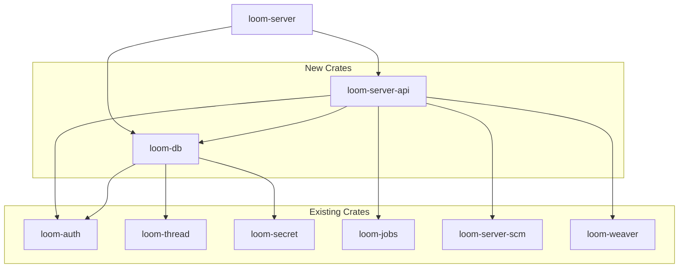

<!--
 Copyright (c) 2025 Geoffrey Huntley <ghuntley@ghuntley.com>. All rights reserved.
 SPDX-License-Identifier: Proprietary
-->

# loom-server Split Specification

This document describes the plan to split `loom-server` (47k lines) into smaller, more focused crates for faster build times and better separation of concerns.

## Current State

```
loom-server (47,056 lines)
├── src/db/           6,437 lines  - SQLite repositories
├── src/routes/      19,824 lines  - HTTP route handlers
├── src/tests/        7,685 lines  - Integration tests (in src/)
├── src/websocket/    1,289 lines  - WebSocket handlers
├── src/jobs/           947 lines  - Background job wiring
└── src/*.rs         10,874 lines  - Middleware, config, LLM proxy, error types
```

### Problems

1. **Build time**: Any change triggers recompilation of 47k lines
2. **Parallelism**: Cannot compile db layer while routes compile
3. **Test overhead**: Tests in `src/tests/` compile with every build
4. **Tight coupling**: Routes directly access db internals

## Target Architecture

```
┌─────────────────────────────────────────────────────────────────┐
│                        loom-server (thin)                       │
│  main.rs, config, middleware, websocket, LLM proxy (~12k lines) │
└─────────────────────────────────────────────────────────────────┘
                              │
              ┌───────────────┼───────────────┐
              ▼               ▼               ▼
┌─────────────────┐ ┌─────────────────┐ ┌─────────────────┐
│ loom-server-api │ │     loom-db     │ │  tests/ (dir)   │
│  routes, OpenAPI │ │  repositories   │ │ integration     │
│   (~20k lines)   │ │  (~6.5k lines)  │ │  (~7.7k lines)  │
└─────────────────┘ └─────────────────┘ └─────────────────┘
```

## New Crates

### 1. `loom-db` (~6,500 lines)

**Purpose**: Pure database layer with SQLite repositories. No HTTP/Axum dependencies.

**Location**: `crates/loom-db/`

**Contents** (moved from `loom-server/src/db/`):
- `api_key.rs` → `ApiKeyRepository`
- `audit.rs` → `AuditRepository`
- `org.rs` → `OrgRepository`
- `session.rs` → `SessionRepository`
- `share.rs` → `ShareRepository`
- `team.rs` → `TeamRepository`
- `thread.rs` → `ThreadRepository`
- `user.rs` → `UserRepository`
- `mod.rs` → `create_pool()`, `run_migrations()`, shared types

**Dependencies**:
```toml
[dependencies]
chrono = { workspace = true }
loom-auth = { path = "../loom-auth" }  # For User type
loom-secret = { path = "../loom-secret" }
loom-thread = { path = "../loom-thread" }  # For ThreadSummary
serde = { workspace = true }
serde_json = { workspace = true }
sqlx = { version = "0.8", features = ["runtime-tokio", "sqlite"] }
thiserror = { workspace = true }
tokio = { workspace = true }
tracing = { workspace = true }
uuid = { workspace = true }
```

**Exports**:
```rust
pub use api_key::ApiKeyRepository;
pub use audit::AuditRepository;
pub use org::OrgRepository;
pub use session::SessionRepository;
pub use share::ShareRepository;
pub use team::TeamRepository;
pub use thread::ThreadRepository;
pub use user::UserRepository;

pub use types::{GithubInstallation, GithubInstallationInfo, GithubRepo, ThreadSearchHit};

pub async fn create_pool(database_url: &str) -> Result<SqlitePool, DbError>;
pub async fn run_migrations(pool: &SqlitePool) -> Result<(), DbError>;
```

**Error Type**:
```rust
#[derive(Debug, thiserror::Error)]
pub enum DbError {
    #[error("Database error: {0}")]
    Sqlx(#[from] sqlx::Error),
    
    #[error("Not found: {0}")]
    NotFound(String),
    
    #[error("Conflict: {0}")]
    Conflict(String),
    
    #[error("Internal: {0}")]
    Internal(String),
}
```

### 2. `loom-server-api` (~20,000 lines)

**Purpose**: HTTP route handlers and OpenAPI types. Pure request/response logic.

**Location**: `crates/loom-server-api/`

**Contents** (moved from `loom-server/src/routes/`):
- All 25 route modules (`admin.rs`, `auth.rs`, `orgs.rs`, etc.)
- Request/response types with OpenAPI annotations
- `api_docs.rs` (OpenAPI spec generation)

**Dependencies**:
```toml
[dependencies]
axum = { version = "0.8", features = ["macros"] }
chrono = { workspace = true }
loom-auth = { path = "../loom-auth" }
loom-db = { path = "../loom-db" }
loom-github-app = { path = "../loom-github-app", features = ["openapi"] }
loom-google-cse = { path = "../loom-google-cse", features = ["openapi"] }
loom-i18n = { path = "../loom-i18n" }
loom-jobs = { path = "../loom-jobs" }
loom-scm = { path = "../loom-server-scm" }
loom-scm-mirror = { path = "../loom-scm-mirror" }
loom-secret = { path = "../loom-secret" }
loom-smtp = { path = "../loom-smtp" }
loom-thread = { path = "../loom-thread", features = ["openapi"] }
loom-version = { path = "../loom-version", features = ["serde", "utoipa"] }
loom-weaver = { path = "../loom-weaver" }
serde = { workspace = true }
serde_json = { workspace = true }
thiserror = { workspace = true }
tokio = { workspace = true }
tracing = { workspace = true }
url = "2"
utoipa = { version = "5", features = ["axum_extras", "uuid", "chrono"] }
uuid = { workspace = true }
```

**Features**:
```toml
[features]
default = ["openapi"]
openapi = ["utoipa", "loom-github-app/openapi", "loom-google-cse/openapi", "loom-thread/openapi"]
```

**Key Challenge**: Routes currently access `AppState` which contains many fields. Solution:

```rust
// loom-server-api/src/lib.rs

/// Trait for route dependencies - implemented by AppState in loom-server
pub trait ApiContext: Clone + Send + Sync + 'static {
    fn db(&self) -> &DbContext;
    fn auth_config(&self) -> &loom_auth::middleware::AuthConfig;
    fn base_url(&self) -> &str;
    // ... other accessors
}

/// Database context grouping all repositories
pub struct DbContext {
    pub users: Arc<UserRepository>,
    pub sessions: Arc<SessionRepository>,
    pub orgs: Arc<OrgRepository>,
    pub teams: Arc<TeamRepository>,
    pub threads: Arc<ThreadRepository>,
    pub api_keys: Arc<ApiKeyRepository>,
    pub audit: Arc<AuditRepository>,
    pub shares: Arc<ShareRepository>,
}
```

### 3. `loom-server` (Remaining ~12,000 lines)

**Purpose**: Binary entrypoint, middleware, config, wiring.

**Contents**:
- `main.rs` - Binary entrypoint
- `api.rs` - `AppState`, `create_router()`, wiring
- `config.rs` - `ServerConfig`
- `error.rs` - `ServerError` (HTTP error responses)
- `typed_router.rs` - `AuthedRouter`, `PublicRouter`
- `abac_middleware.rs` - ABAC authorization
- `auth_middleware.rs` - Authentication layer
- `websocket/` - WebSocket handlers
- `llm_proxy.rs`, `llm_query_*.rs` - LLM proxy logic
- `oauth_state.rs` - OAuth state management
- `query_*.rs` - Query metrics/tracing
- `jobs/` - Job scheduler wiring (or move to loom-jobs)

**Dependencies**:
```toml
[dependencies]
loom-db = { path = "../loom-db" }
loom-server-api = { path = "../loom-server-api" }
# ... existing deps minus routes-only deps
```

### 4. Integration Tests

**Move**: `src/tests/*.rs` → `tests/*.rs`

This removes 7,685 lines from the library compilation unit. Integration tests only compile when running `cargo test`.

```
crates/loom-server/
├── src/
│   └── ... (no tests/ subdirectory)
└── tests/
    ├── auth_integration_tests.rs
    ├── end_to_end_tests.rs
    ├── query_detection_tests.rs
    ├── query_handler_tests.rs
    ├── query_integration_test.rs
    ├── query_manager_integration_tests.rs
    ├── query_metrics_integration_tests.rs
    ├── query_security_tests.rs
    ├── query_tracing_tests.rs
    ├── share_tests.rs
    └── tracing_integration_tests.rs
```

## Migration Plan

### Phase 0: Quick Win - Move Tests (1-2 hours)

**Effort**: S  
**Risk**: Low  
**Build time impact**: Removes 7.7k lines from `cargo build`

1. Create `crates/loom-server/tests/` directory
2. Move all files from `src/tests/` to `tests/`
3. Remove `#[cfg(test)] mod tests;` from `lib.rs`
4. Update test imports (change `crate::` to `loom_server::`)
5. Run `cargo test -p loom-server` to verify

### Phase 1: Extract `loom-db` (4-6 hours)

**Effort**: M  
**Risk**: Low-Medium  
**Build time impact**: Enables parallel compilation of db layer

1. Create `crates/loom-db/` with `Cargo.toml`
2. Copy `loom-server/src/db/` → `loom-db/src/`
3. Create `loom-db/src/error.rs` with `DbError` type
4. Update `loom-db/src/mod.rs`:
   - Change `use crate::error::ServerError` → `use crate::error::DbError`
   - Export all repositories and types
5. Move migrations:
   - Keep in `loom-server/migrations/` (or move to `loom-db/migrations/`)
   - Update `include_str!` paths accordingly
6. Add `loom-db` to workspace `Cargo.toml`
7. Update `loom-server/Cargo.toml` to depend on `loom-db`
8. Update all `loom-server` imports:
   - `use crate::db::*` → `use loom_db::*`
9. Run `cargo build --workspace` and fix errors
10. Run `cargo test --workspace`

### Phase 2: Extract `loom-server-api` (6-10 hours)

**Effort**: L  
**Risk**: Medium  
**Build time impact**: Largest improvement - enables parallel route compilation

1. Create `crates/loom-server-api/` with `Cargo.toml`
2. Define `ApiContext` trait in `loom-server-api/src/context.rs`
3. Copy `loom-server/src/routes/` → `loom-server-api/src/routes/`
4. Move `api_docs.rs` → `loom-server-api/src/api_docs.rs`
5. Update route handlers to use `ApiContext` trait instead of `AppState`:
   ```rust
   // Before (in loom-server)
   async fn handler(State(state): State<AppState>) -> Result<..> {
       state.user_repo.get_user(id).await?
   }
   
   // After (in loom-server-api)
   async fn handler<C: ApiContext>(State(ctx): State<C>) -> Result<..> {
       ctx.db().users.get_user(id).await?
   }
   ```
6. Alternatively, keep concrete `AppState` and re-export from `loom-server`:
   ```rust
   // loom-server-api depends on type from loom-server (circular!)
   // Better: define AppState in loom-server-api, import in loom-server
   ```
7. Add `loom-server-api` to workspace
8. Update `loom-server` to import routes from `loom-server-api`
9. Run `cargo build --workspace` and fix errors
10. Run `cargo test --workspace`

**Alternative for Phase 2**: If the `AppState` coupling is too complex, consider:
- Keep routes in `loom-server` but split into feature-gated modules
- Use a "hexagonal" approach: routes call service traits, services live in separate crates

### Phase 3: Cleanup and Optimization (2-4 hours)

1. Add feature flags to `loom-server-api` for optional OpenAPI
2. Update `devenv.nix` git hooks to use `--no-default-features` for faster pre-commit
3. Add `.cargo/config.toml` with mold linker
4. Add profile optimizations to workspace `Cargo.toml`

## Dependency Graph After Split



## Build Time Estimates

| Scenario | Before | After (Est.) |
|----------|--------|--------------|
| Clean build | 100% | ~95% (small overhead from crate metadata) |
| Touch `db/user.rs` | Rebuild 47k lines | Rebuild 6.5k lines (loom-db) + link |
| Touch `routes/orgs.rs` | Rebuild 47k lines | Rebuild 20k lines (loom-server-api) + link |
| Touch `main.rs` | Rebuild 47k lines | Rebuild 12k lines (loom-server) + link |
| Run tests | Compile 47k + 7.7k | Build skips test code unless `cargo test` |

With mold linker + profile optimizations, incremental builds should be **2-3x faster** for common changes.

## Risks and Mitigations

| Risk | Mitigation |
|------|------------|
| Circular dependencies between crates | Define traits in leaf crates, implement in parent |
| Breaking public API | Keep `loom-server` re-exporting types for compatibility |
| Migration introduces bugs | Phase approach, run full test suite after each phase |
| `AppState` coupling too deep | Consider service trait approach vs direct repository access |

## Decision Points

1. **Migrations location**: Keep in `loom-server/migrations/` or move to `loom-db/migrations/`?
   - Recommendation: Keep in `loom-server` since it's the binary that runs migrations

2. **`AppState` refactor approach**:
   - Option A: Trait-based (`ApiContext`) - cleanest but most work
   - Option B: Move `AppState` to `loom-server-api` - simpler but couples api to wiring
   - Option C: Keep routes in `loom-server`, only extract `loom-db` - minimal disruption
   - Recommendation: Start with Option C, evaluate if more splitting needed

3. **Feature flags for OpenAPI**:
   - Recommendation: Yes, makes dev builds faster when swagger UI not needed

## Success Criteria

- [ ] `cargo build -p loom-server` completes in <30s (incremental, after loom-db change)
- [ ] `cargo build -p loom-db` completes in <10s (incremental)
- [ ] All existing tests pass
- [ ] No new `unsafe` code introduced
- [ ] CI build time not significantly increased
